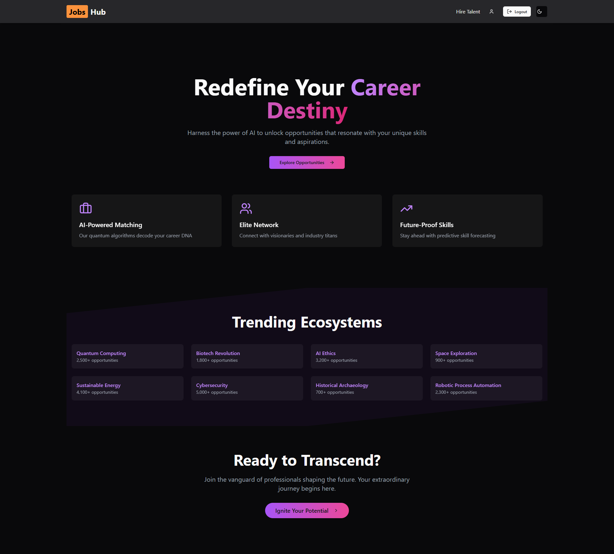
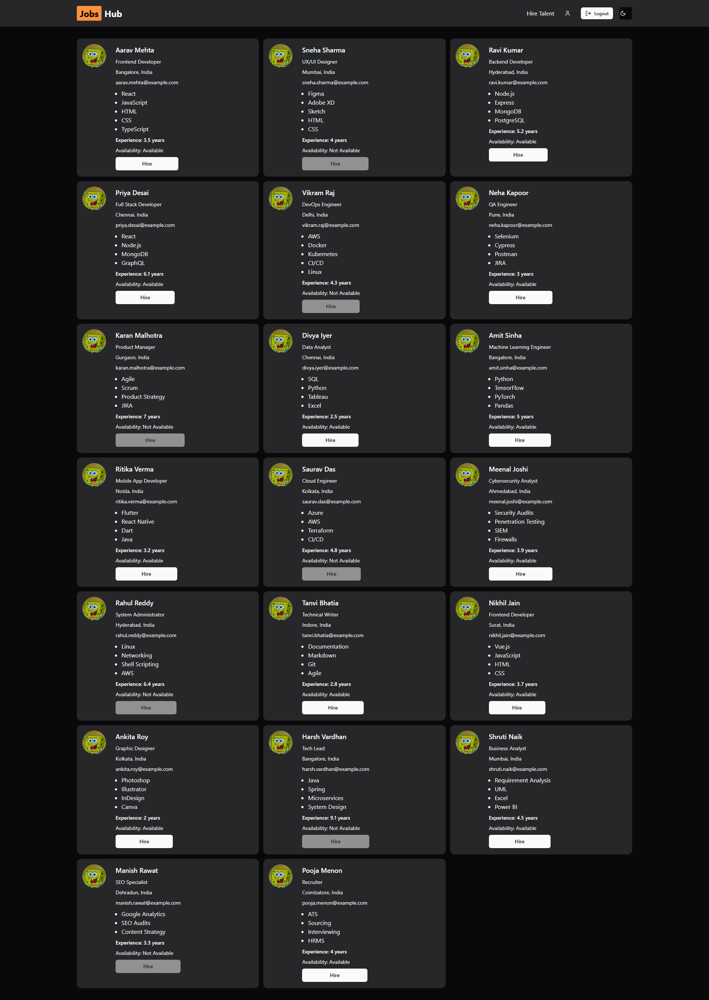
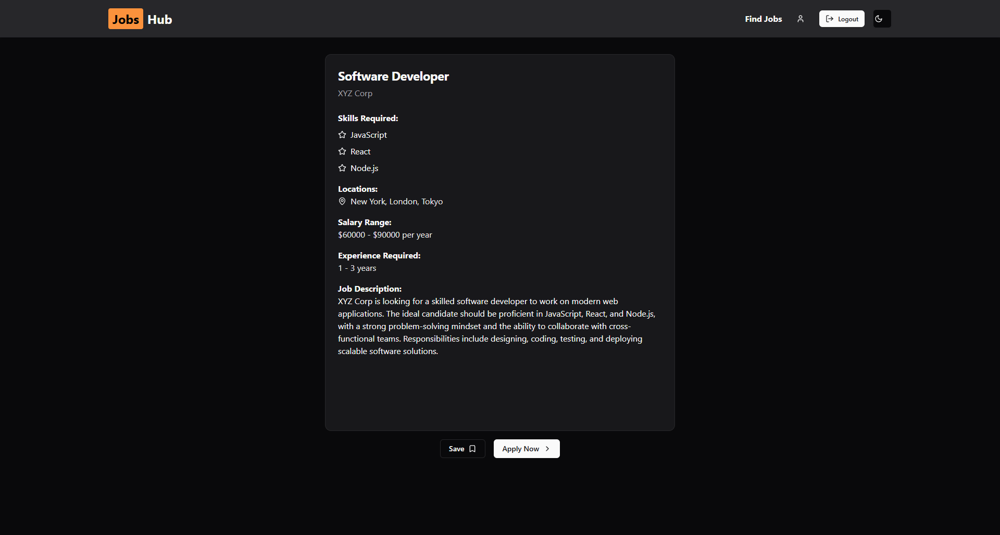
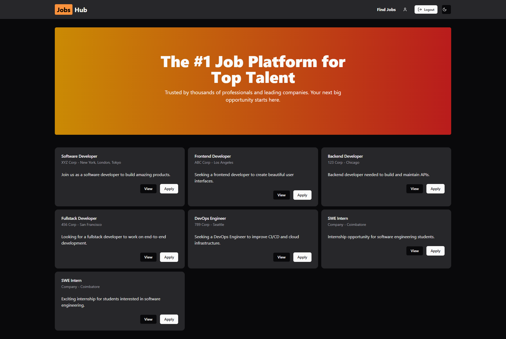
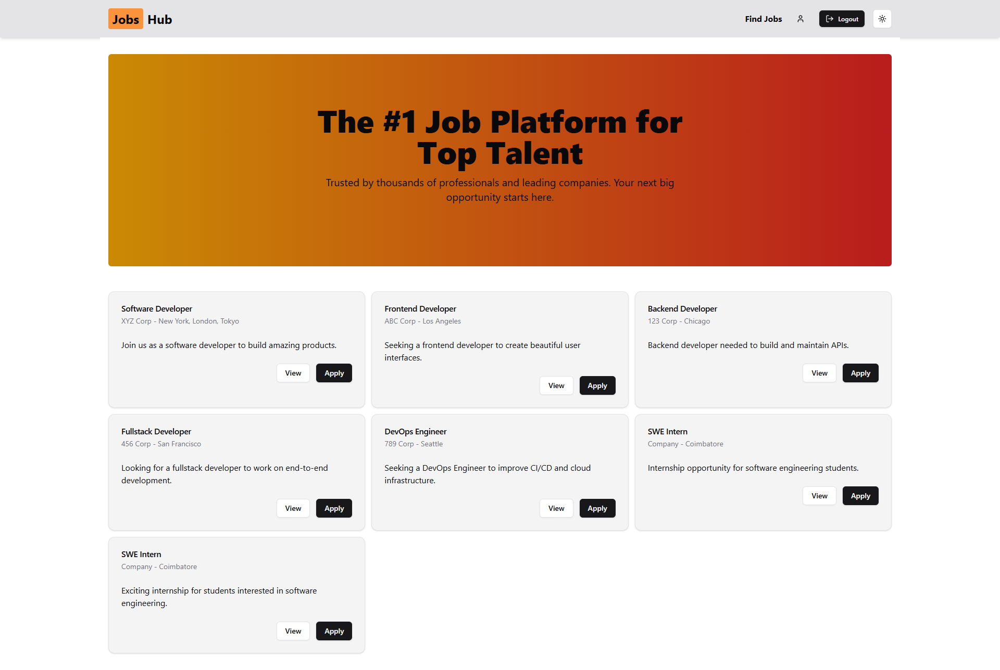
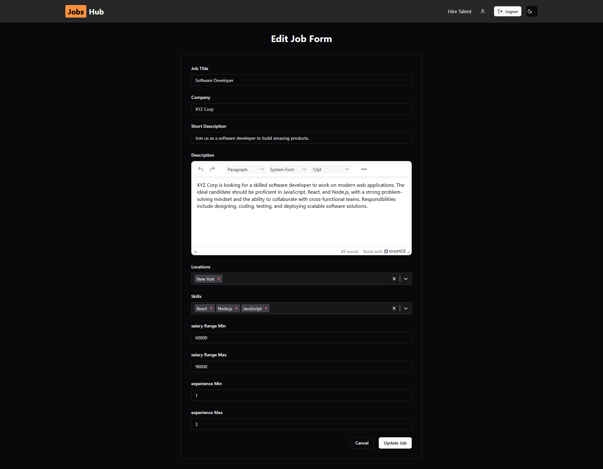
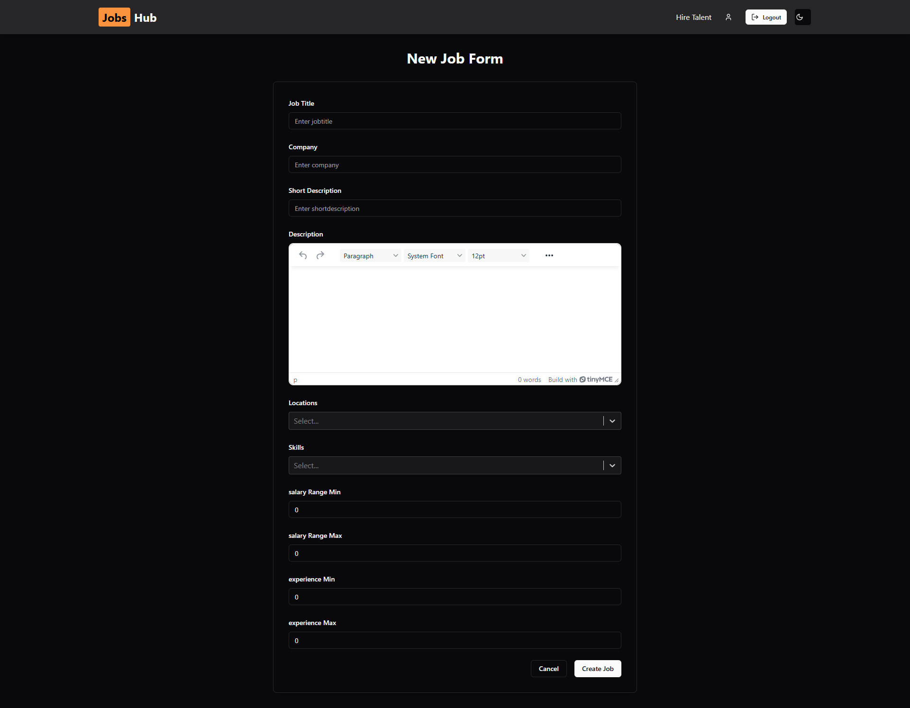
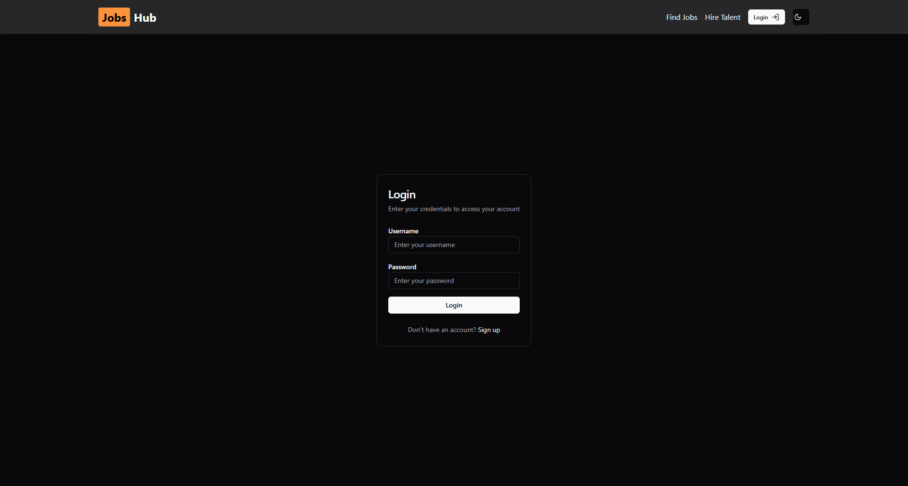

# Job Portal

A modern job portal application built to streamline job posting and management. It provides features for both users and admins, making it easier to create, manage, and explore job opportunities with an intuitive interface.

---

## 🚀 Tech Stack

- **Frontend Framework:** React, TypeScript  
- **Routing & Forms:** React Router, React Hook Form  
- **State Management:** Redux Toolkit  
- **UI Components & Styling:** Shadcn UI, Tailwind CSS  
- **Backend (Mock API):** JSON Server  
- **Text Editor:** TinyMCE (WYSIWYG Editor)

---

## ✨ Features

- ✅ Add new job postings  
- ✅ Edit existing job details  
- ✅ Delete jobs from the list  
- ✅ Save jobs for later  
- ✅ Light/Dark/System theme toggle  
- ✅ Profile management page  
- ✅ Role-based access (User & Admin)  

## Login Info

- Login as user **username:** magesh, **password:** password
- Login as admin **username:** sam, **password:** password

## Screenshots

Here are some screenshots of the project:

 

 

 

 

 

 

 

