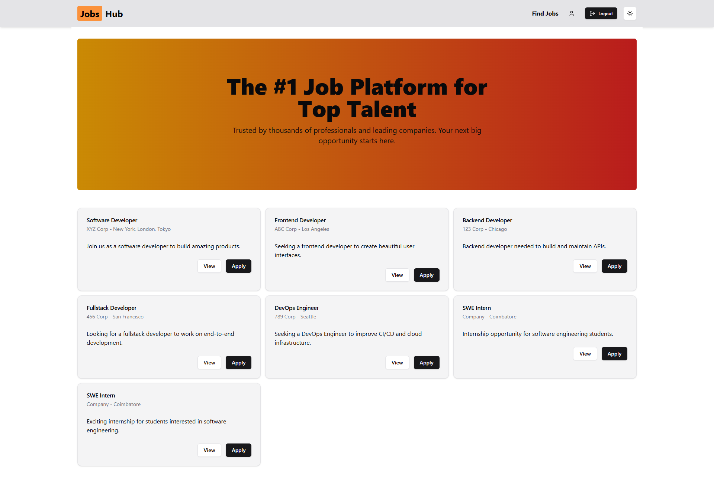

# Job Portal

**Tech Stack:** React, Typescript, React Router, React Hook Form, Redux Toolkit, Shadcn UI, Tailwind css, JSON server - to mock API. TinyMCE - WYSIWYG Text Editor

## Features

- [x] Add new job
- [x] Edit an existing job
- [x] Delete a job
- [x] Save a job
- [x] Light/Dark/System Theme Toggle
- [x] Profile page
- [x] Different user roles (user, admin)

## How to setup locally

- Clone the repo
  `git clone https://github.com/Magesh-sam/job-portal.git`
- install dependencies
  `pnpm install`
- get tinyMCE key for WYSIWYG editor and add it in your .env
- run front-end : `pnpm run dev`
- run json-server(API) : `pnpm run serve`
- Feel free to customize **db.json** (data for API)

## Login Info

- Login as user **username:** magesh, **password:** password
- Login as admin **username:** sam, **password:** password

## Screenshots

Here are some screenshots of the project:

 

 

 

 

 

 

 

